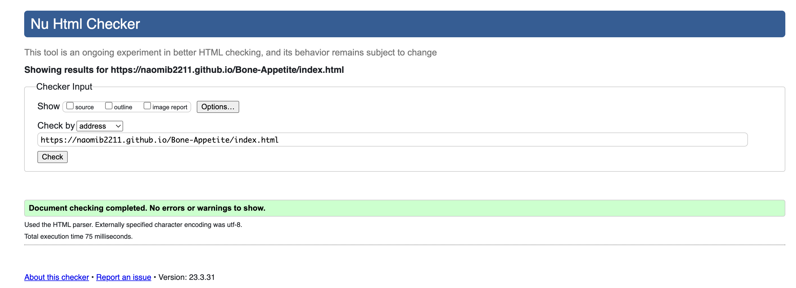
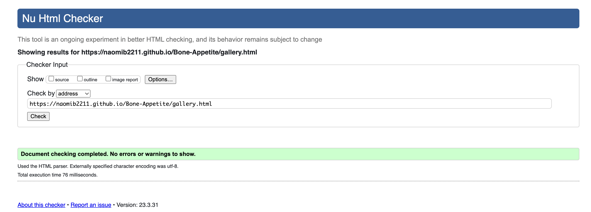
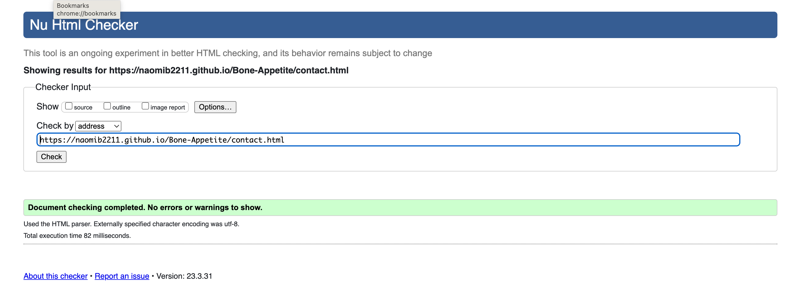
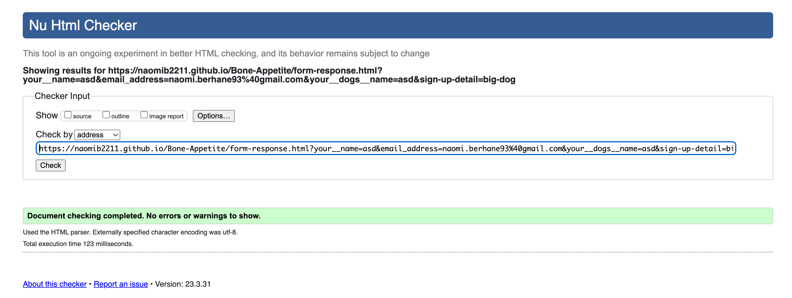
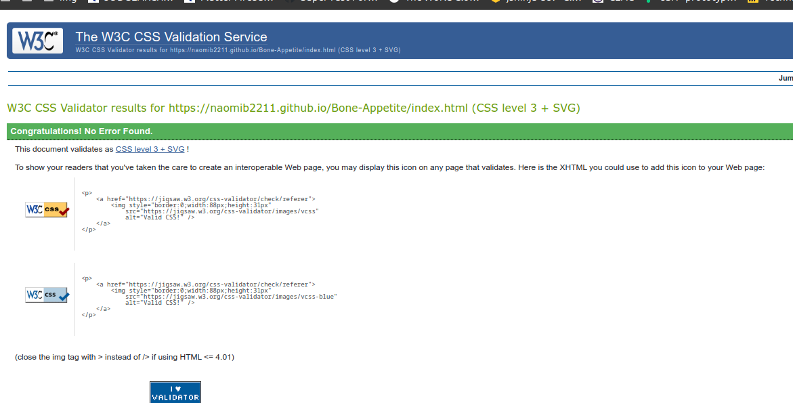
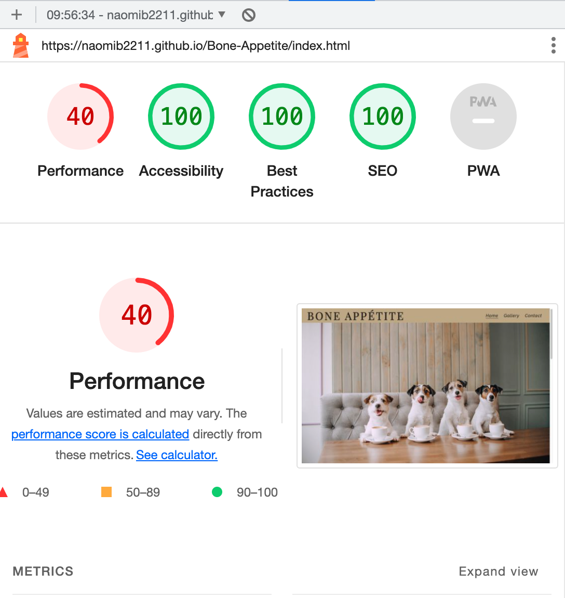
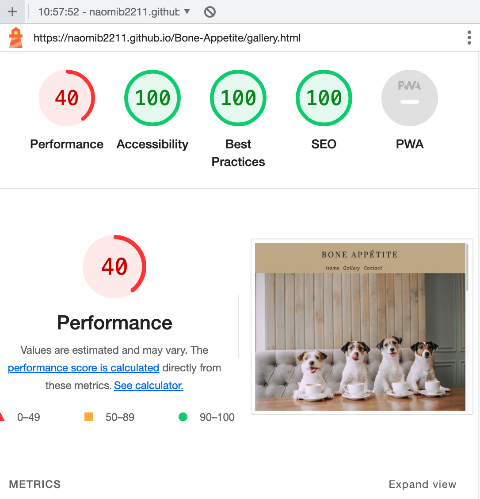
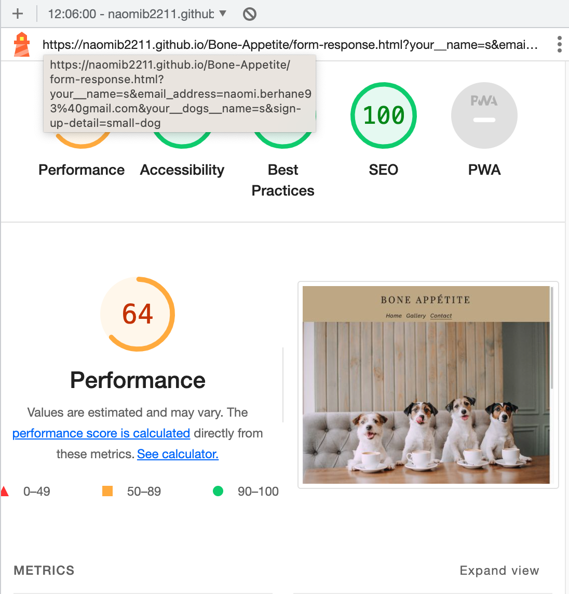

[Bone Appétite Logo Image](documentation/logo-image.pdf)

---

# *Bone Appétite Cafe*

The dog cafe Bone Appétite website serves its purpose by informing dog owners about the physical dog café, that they can visit and also meet other likeminded people with their respective pet dogs. Additionally the website informs about the dog community created by the cafe, in order to for the visitor to find a new community. 

To visit the website click [here](https://naomib2211.github.io/Bone-Appetite/index.html)

[amiresponsive-image](documentation/am_i_responsive.pdf)

---
## User Stories

### First Time Visitor Goals:

* As a First Time Visitor, I wish for a quick overview of what this cafe entails.
* As a First Time Visitor, I wish for a simple layout to easily navigate through the information that I am looking for.
* As a First Time Visitor, I wish to easily connect with the cafe and the community.

### Returning VisitorGoals:

* As a Returning Visitor, I wish to see what past events have been like in order to make an informed decision to join the community.
* As a Returning Visitor, I want to find a way to get in contact with the café, so that I can ask additional questions or just join the dog community through their social media.

## Features

+ ### Navbar

+ ##### Navigation
    - Positioned at the top of the page.
    - Contains a title of the cafe name on the left side.
    - Contains navigation links on the right side:
        * HOME - leads to the home page where the visitors gets a simple overview of what this cafe is about.
        * GALLERY - leads to the gallery page where users can see images from past events that the cafe organizes.
        * CONTACT - leads to the contact form page where users can fill out the form in order to get involved in the dog community created by the cafe.
    - The links have underlining hover effect.
    - The navigation is clear and easy to understand for the user.

    [NavBar desktop](documentation/navbar.pdf)

    - The navigation bar is responsive:
        * On tablets: navigation bar is split into to lines: the first line filled with the cafe title that now has a slightly smaller font-size and the second line with navigation links in a row. All elements are centered.
        [NavBar Tablets](documentation/navbar_tablet.pdf)

        * On mobile devices: 
            - similarly to tablet-screens, the navigation bar is filled with the cafe title with even smaller font-size and beneath, in the second line the navigation links, lined in a row. All elements centered.
            [NavBar Mobile Closed](documentation/navbar_mobile.pdf)
        

---

+ ### Home Page

    - Contents: 

        * Shows the purpose of the cafe.
        * Why this cafe is different than others.
        * The variety of things the cafe offers.

    [Home Page](documentation/home__page.pdf)

---

+ #### Hero Section

    - The hero section has a background image.

    - The background image presents what the cafe stands for - dogs and cafe environment.

    
    [Hero Section](documentation/hero__image.pdf)

--- 

---    
+ #### Main Home Page Section

    - The main section of the home page highlights why the cafe exists.

    - The main section explains the three important aspects of the cafe, with both text and images to highlight the cafe's message to the visitor.

    - The main section has simple and easy to understand design for the visitor to get the quick information they need to make an informed decision.

    
    [Home page main section](documentation/home_page_main.pdf)

---
+ #### Footer

    - Footer contains social media links that open in a new tab.
​
    [Footer](documentation/home_page_footer.pdf)
​
---
+ ### Gallery Page

    - The gallery page introduces the visitor with the same hero image.

    - Scrolling down, the visitor can read about the events and community the cafe has started, for the visitor to join.

    - It informs that all kinds of dogs are welcome, as there are different events for different sized dogs.

    - The gallery is responsive, the size of the photo depends on the user's screen.

    - The footer is identical to the homepage, as well as the other pages.
    
​
    [Gallery Page](documentation/gallery_section.pdf)

---
+ ### Contact page

    - Contact page has a sign up form:

        - All text input fields are customized with colors matching the page.
        - Labels in the input are adjusted to the page's requirements for a sign up.
        - All inputs are set to be required to fill out.
        - It has three checkboxes for the visitors to fill in order for the cafe to know the vistor's needs:

            *  First checkbox, "Small Dog" asks if the visitor wants their dog to join a small dog-event.
            *  Second checkbox, "Big Dog" asks if the visitor wants their dog to join a big dog-event.
            *  Third and last checkbox, "No Preference" asks if the visitor has no preference about the specific size of dogs in the upcoming events.

        - The submit button is animated on hover, in matching color of page.

        - The page is responsive on all common screen sizes.

        - The submit button leads to the response page.
​
    [Contact page](documentation/contact_page.pdf)

---
+ ### Response page

    - The response page automatically appears when the visitor submits the sign up-form correctly.
    - It contains a thank you message and that the cafe will contact the visitor for the next coming events.
    - It encourages the visitor to engage in their social media pages until then.
    - There is a "Go Back to Home" button, that redirects visitor to Home page.

    [Response page](documentation/form-response-page.pdf)

---
## Technologies Used

- [HTML](https://developer.mozilla.org/en-US/docs/Web/HTML) - used to create the base of the home page.
- [CSS](https://developer.mozilla.org/en-US/docs/Web/css) - used to style the html created for the home page.
- [CSS Flexbox](https://www.w3schools.com/css/css3_flexbox.asp) - used to structure images overall page.
- [CSS Grid](https://css-tricks.com/almanac/properties/g/grid-template-columns/) - used to further structure images on all pages and sign up-form in the Contact-page.
- [Midjourney](https://www.midjourney.com/home/?callbackUrl=%2Fapp%2F)  - used to create AI-photos, for two images in the Gallery page.
- [Balsamiq](https://balsamiq.com/)  - used to make the wireframe of the website.
- [VSCode](https://code.visualstudio.com/) - used as the main tool to write and edit code.
- [Git](https://git-scm.com/) - used for version control of the website.
- [GitHub](https://github.com/) was used for hosting the codes created for the website.

---
## Design

[Color Theme](documentation/adobeColor-My-Color-Theme.pdf)

- These colors were customized on Adobe color.
- This combination of colors were used to create a warm and inviting first impression, but also feeling overall.
- The different tones and shades of brown gives an earthy and natural vibe.
- Another reason for using this combination of colors was to bring forth the color of cookies, where a "classic" cookie has different shades of brown and beige to present the cookie dough and chocolate pieces.

[Playfair](documentation/playfair.pdf)

- Used for the logo title of the cafe name.
- It was chosen to show a classic and stylish look, in contrast to the cute and warm overall feeling of the website and the cafe's message.
- Contrast to the other text sections of the website, in order to highlight the name of the cafe, making it more memorable.

[Raleway](documentation/raleway.pdf)

- Used for all the parts containing text except for the logo title. 
- Less "harsh" than the logo title, to give a softer look together with the color theme. 
- Goes along well with the message in each body of text in the main-section, to push forward the message of a warm welcome.

---

## Testing

Testing has been done in order to correctly present functionality, responsiveness and appearance.

+ The website was tested on the following browsers: Chrome, Firefox, Safari.

    - Chrome:

    

    - FireFox:

    

    - Safari:

    

    In the future, functioning screen recordings will be added to this document. 

+ The website was checked through devtools in all three browsers Chrome, Firefox and  Safari.

    - Main Page:

    

    - Gallery Page:

    

    - Contact Page:

    

    - Response Page:

    

+ The website was checked with [Responsive Website Design Tester](https://responsivedesignchecker.com/).

- In the following images Desktop, tablet and mobile responsiveness is presented:

    [Home page](documentation/responsiveness_home_page.pdf)
    [Gallery Page](documentation/responsiveness_gallery_page.pdf)
    [Contact Page](documentation/responsiveness_contact_page.pdf)

+ The website has been tested by several users.

### Manual testing

| feature      | action | expected result | tested              | passed | comments |
| ---          | ---    | ---             | ---                 |   ---  | ---      |
| home link    | click  | user is redirected to the home page   | Y | Y | |
| gallery link | click  | user is redirected to the gallery page | Y | Y | |
| contact link | click  | user is redirected to the contact page | Y | Y | |
| instagram link | click | instagram page is opened in a new tab | Y | Y | |
| facebook link | click | facebook page is opened in a new tab  | Y | Y | |
| twitter link | click | twitter page is opened in a new tab    | Y | Y | |
| youtube link | click | youtube page is opened in a new tab    | Y | Y | |
| submit button in contact form | click when form is not filled | form is not submitted and error message is displayed | Y | Y | |
| submit button in contact form | click when form is filled but the email is not valid | form is not submitted and error message is displayed                                                       | Y | Y | |
| submit button in contact form | click when form is filled and the email is valid but the user didn't mark the checkbox | form is still submitted without any errors and user is redirected to thankyou page | Y | Y | it is done on purpose as if user doesn't check their preferences, assumption will be made visitor is ok with all of the options |
| "return to home" button in response page | click | user is redirected to the home page | Y | Y | |

---
​
### Bugs
+ ##### Solved bugs
    1. Logo title had an underline that would not go away.
        Solution: Targeted the logo title in CSS and added it with property and value of "text-decoration: none;".

    ---
+ ##### Unsolved bugs

    - None

+ ##### Mistakes

    - Throughout this project, there were some mistakes in how changes were commited. 
        * Commited in past tense
        * Commit messages were too long
        * Unnecessary commits
    - Learned through much practice to write commits in present tense, simpler descriptions to keep it short and waited until greater changes were made to commit changes. 

    - Accidental additions of unknown files
        * Being new to coding and programming technology caused these errors. In the future, this will be corrected and modified.

---
## Validator testing
+ ### HTML

  #### Home Page
   
    - No errors found, as seen below.

    
    
  #### Gallery Page
    
    - No errors found, as seen below.

    

  #### Contact Page
   
    - No errors found, as seen below.

    

  #### Response Page
   
    - No errors found, as seen below.

    
    
+ ### CSS
    
    - No errors found, as seen below.

    
    

+ ### Accessibility and performance 

    
    
    
    

    - Using Lighthouse in dev tools, the performance score was set. Everything is 100% except for in the "performance" section on all pages, including the response page.
        * This is because of the images of the page. Not re-sizing the images before adding to page, caused this performance score.
---
## Deployment

 - The site was deployed to GitHub pages. To deploy, these steps were used:
 * In GitHub repository, go to the Settings tab
 * Select "Main Brance" from the source section in the drop down menu. Save.
 * Following a successful deployment, the page will automatically refresh, accompanied by a detailed ribbon display to signify the completion.

The website's [Live link](https://naomib2211.github.io/Bone-Appetite/index.html)

## Local Deployment

- To make a local deployment, a local copy, clone this to the IDE of their choice:
    * https://github.com/Naomib2211/Bone-Appetite.git

- Alternatively, go to my [Github](https://github.com/Naomib2211/Bone-Appetite) and click on the green "Code" button on the left side, above the repository and copy the local link there.

---
 + ### Future Improvements

 - Add favicon with [Favicon Generator. For real.](https://realfavicongenerator.net/);
 - Add custom 404 page
 - Add accessability report with [WAVE Web Accessibility Evaluation Tool](https://wave.webaim.org/);
 - As I am aware that I have made errors in my commit messages during the development process, I will try to improve my commit messages in the future
 - Add fully functional contact form when I learn how to do it in the future
 - Compress images to improve the performance of the website

---
## Credits

+ #### Content

    - Took inspiration from a dog cafe in South Korea [Bauhouse](https://www.neverendingfootsteps.com/visiting-the-dog-cafe-in-seoul/)
    - My Mentor Julia's first project [Dog-Shelter](https://iuliiakonovalova.github.io/animal_shelter/)

+ #### Media

- Color scheme
    * [Adobe](https://color.adobe.com/My-Color-Theme-color-theme-e50fc2ae-7ade-45b4-a3a2-fea6e921be1f/)
- Font style 
    * [Playfair](https://fonts.google.com/specimen/Playfair+Display?preview.text=We%20have%20lots%20of%20treats%20and%20fun%20things%20to%20do&preview.size=35&preview.text_type=custom&query=playf)
    * [Raleway](https://fonts.google.com/specimen/Raleway?preview.text=We%20have%20lots%20of%20treats%20and%20fun%20things%20to%20do&preview.size=35&preview.text_type=custom&query=raleway)

+ # Images
- Gallery Page
    * [Hero-image](https://stock.adobe.com/ie/contributor/203341399/ksuksa?load_type=author&prev_url=detail&asset_id=302972361)
    * [Food-and-drinks-section](https://www.pexels.com/photo/dog-food-in-a-glass-container-10880504/)
    * [Dogs-place-section](https://www.pexels.com/photo/woman-looking-at-her-pet-dog-9509757/)
    * [Hangout-section](https://unsplash.com/photos/73flblFUksY)
- Gallery Page 
    * [image-1](https://www.pexels.com/photo/three-dogs-playing-together-11512316/)
    * [image-2](https://www.pexels.com/photo/a-cute-dogs-running-on-green-grass-field-12874286/)
    * [image-3](https://www.pexels.com/photo/two-dogs-with-one-stick-on-grass-5938325/)
    * [image-4](https://www.pexels.com/photo/retriver-dogs-playing-with-plush-monkey-14084426/)
    * [image-5](https://www.pexels.com/photo/two-brown-dachshund-976921/)
    * [image-7](https://www.pexels.com/photo/a-two-golden-retrievers-playing-tug-of-war-on-a-snow-covered-ground-11249182/)

    Gallery images generated by author Shaqn using “Midjourney” 
    * [image-5](https://www.pexels.com/photo/photo-of-dogs-running-14520087/)  
    * [image-8](midjourney.com/app/users/02ac4226-92af-4ee1-b4cd-50c84281055a/)

+ #### Acknowledments

- My Mentor [Julia Konovalov](https://github.com/IuliiaKonovalova) who has greatly supported me throughout the journey of my first project, when I had no idea where to even start.
- My friend Jonatan Sirak, a programmer who supported me with pointers.
- [Code Institute](https://codeinstitute.net/se/) with fundamental knowledge to even be able to code.
- My friend Emma Hedman, with mental support and a visitor of this website.
- [Kevin Powell](https://www.youtube.com/user/KepowOb) for guidance in knowledge of flexbox and responsivity. 

## wireframes

[wireframes](documentation/bone_appetite_wireframe.pdf)